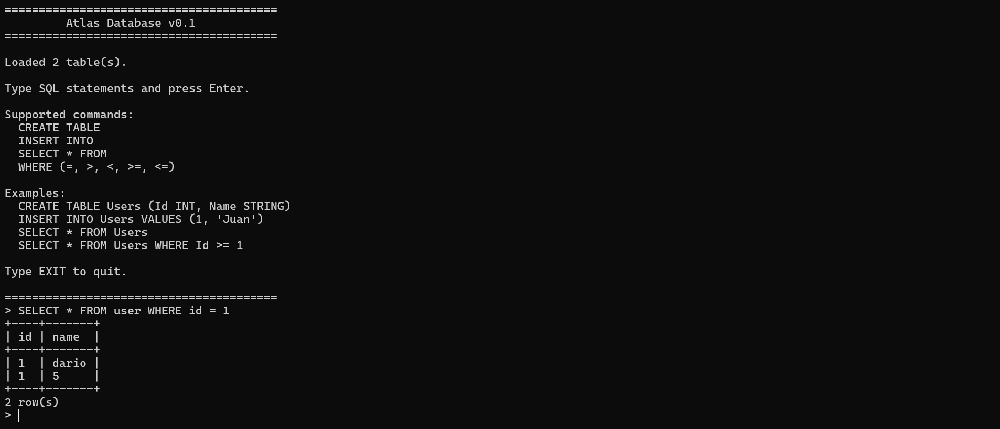

# Atlas

Atlas is an experimental relational database engine built from scratch in C# and .NET.

The goal of Atlas is to explore how database systems work internally by implementing every layer manually, from lexical analysis and SQL parsing to query execution, storage management, and persistence.

This project is designed as a learning-oriented database engine rather than a production-ready database.



## Features

### SQL Parsing

Atlas includes a custom SQL parser composed of:

* Lexer (tokenizer)
* Parser
* Abstract Syntax Tree (AST)

Supported statements:

```sql
CREATE TABLE Users (Id INT, Name STRING);

INSERT INTO Users VALUES (1, 'John');

SELECT * FROM Users;

SELECT * FROM Users WHERE Id >= 1;
```

---

### Query Execution

Atlas executes SQL statements through a dedicated execution engine.

Currently supported:

* CREATE TABLE
* INSERT INTO
* SELECT
* WHERE filtering

Supported comparison operators:

```sql
=
>
<
>=
<=
```

---

### Storage Engine

Atlas uses an in-memory storage engine with persistence.

Core entities:

* Table
* Column
* Row
* Cell

Tables are stored in memory for fast access and can be flushed to disk.

---

### Persistence

Atlas persists tables using a custom file format.

Example:

```text
Id:INT|Name:STRING
1|John
2|Alice
3|Bob
```

At startup, Atlas automatically loads all persisted tables into memory.

---

### Type System

Currently supported types:

* INT
* STRING

Type validation occurs during INSERT operations to ensure data consistency.

---

### Query Results

Atlas returns structured query results and renders them in a console table format.

Example:

```text
+----+-------+
| Id | Name  |
+----+-------+
| 1  | John  |
| 2  | Alice |
+----+-------+

2 row(s)
```

---

## Architecture

```text
SQL Query
    │
    ▼
 Lexer
    │
    ▼
 Parser
    │
    ▼
 AST
    │
    ▼
 Executor
    │
    ▼
 Storage Engine
    │
    ▼
 Persistence Layer
```

Project structure:

```text
Atlas
├── Parser
│   ├── Lexer
│   ├── Parser
│   ├── Token
│   └── AST
│
├── Executor
│   ├── Executor
│   ├── QueryResult
│   └── ExpressionEvaluator
│
├── Storage
│   ├── MemoryStorageEngine
│   ├── IStorageEngine
│   └── Models
│
└── Program.cs
```

---

## Current Limitations

Atlas is still in an early stage.

Not yet implemented:

* UPDATE
* DELETE
* Indexes
* B-Trees
* Transactions
* WAL (Write-Ahead Logging)
* Query optimization
* Multi-column selection
* JOIN operations
* Aggregations
* Concurrency control

---

## Roadmap

Planned features:

* Column projection (`SELECT Name FROM Users`)
* Logical operators (`AND`, `OR`)
* UPDATE statements
* DELETE statements
* Index support
* B-Tree implementation
* Page-based storage
* Write-Ahead Logging (WAL)
* Transaction support
* Query planner

---

## Motivation

Atlas was created to gain a deeper understanding of database internals by building a relational database engine from first principles.

Instead of relying on existing database systems, the project focuses on implementing core concepts manually, including parsing, execution, storage management, persistence, and query processing.

---

## Built With

* C#
* .NET
* LINQ

---

## License

MIT License
